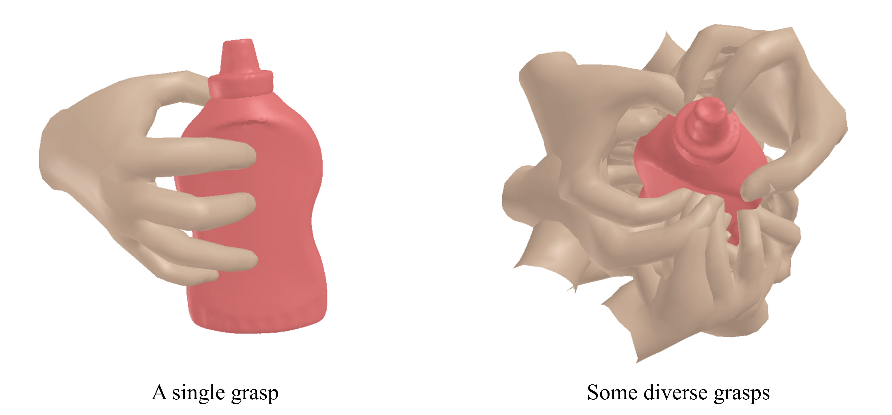

# GraspTTA
### Hand-Object Contact Consistency Reasoning for Human Grasps Generation (ICCV 2021). [](https://arxiv.org/pdf/2108.05877.pdf)

[Project Page with Videos](https://hwjiang1510.github.io/GraspTTA/)


## Demo
###   Quick Results Visualization
We provide generated grasps on out-of-domain HO-3D dataset (saved at ./diverse_grasp/ho3d), you can visualize the results by:
```
python vis_diverse_grasp --obj_id=6
```
The visualization will look like this:



### Generate diverse grasps on out-of-domain HO-3D dataset (the model is trained on ObMan dataset)
You can also generate the grasps by yourself
- First, download [pretrained weights](https://drive.google.com/file/d/10e13bqfKIspjMsKLIO2gwIE-Y9nTtgi6/view?usp=sharing), unzip and put into `checkpoints`.
- Second, download the MANO model files (`mano_v1_2.zip`) from [MANO website](http://mano.is.tue.mpg.de/). 
Unzip and put `mano/models/MANO_RIGHT.pkl` into `models/mano`. And please use [this MANO repo](https://github.com/hwjiang1510/MANO).
- Third, download [HO-3D object models](https://drive.google.com/file/d/1ZiEsq3NHXv6TPXr9TK8XbxywG_22631a/view?usp=sharing), unzip and put into `models/HO3D_Object_models`.

- The structure should look like this:
```
GraspTTA/
  checkpoints/
    model_affordance_best_full.pth
    model_cmap_best.pth
  models/
    HO3D_Object_models/
      003_cracker_box/
        points.xyz
        textured_simple.obj
        resampled.npy
       ......
    mano/
      MANO_RIGHT.pkl
```

- Then, install the [V-HACD](https://github.com/kmammou/v-hacd) for building the simulation of grasp displacement. Change [this line](https://github.com/hwjiang1510/GraspTTA/blob/ae7e0984a128193767f1aa126a7825a019313569/gen_diverse_grasp_ho3d.py#L126) to your own path.
- Finally, run `run.sh` for installing other dependencies and start generating grasps.

### Generate grasps on custom objects
- First, resample 3000 points on object surface as the input of the network. You can use [this function](https://github.com/hwjiang1510/GraspTTA/blob/ae7e0984a128193767f1aa126a7825a019313569/dataset/utils_HO3D_FPHA.py#L22).
- Second, write your own dataloader and related code in `gen_diverse_grasp_ho3d.py`.


## Training code
Please email me if you have interest in the training code. I don't have enough bandwidth to clean up the code now. But I am happy to provide a raw version of it.

## Citation
```
@inproceedings{jiang2021graspTTA,
          title={Hand-Object Contact Consistency Reasoning for Human Grasps Generation},
          author={Jiang, Hanwen and Liu, Shaowei and Wang, Jiashun and Wang, Xiaolong},
          booktitle={Proceedings of the International Conference on Computer Vision},
          year={2021}
}
```

## Acknowledgments
We thank:
* [MANO](https://github.com/otaheri/MANO) provided by Omid Taheri.
* This implementation of [PointNet](https://github.com/yanx27/Pointnet_Pointnet2_pytorch).
* This implementation of [CVAE](https://github.com/timbmg/VAE-CVAE-MNIST).
